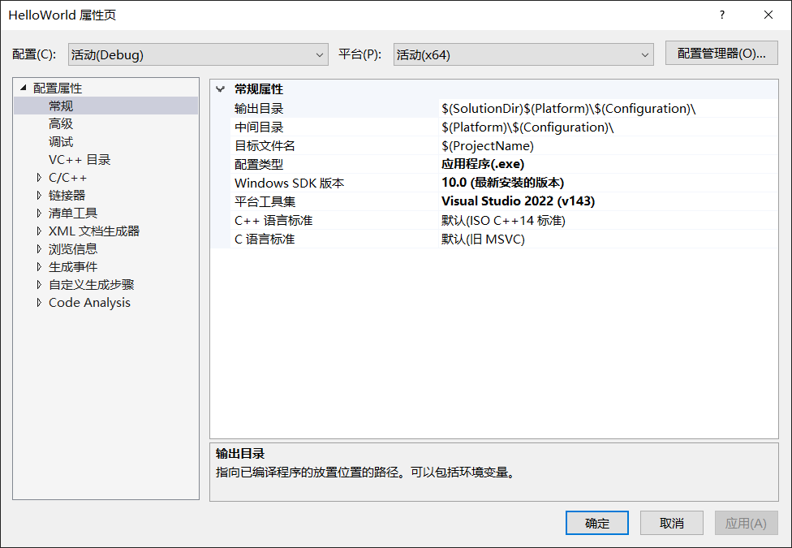
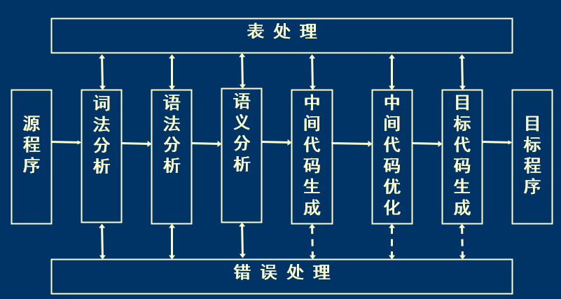
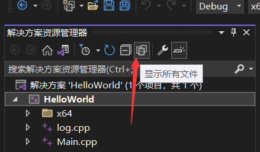
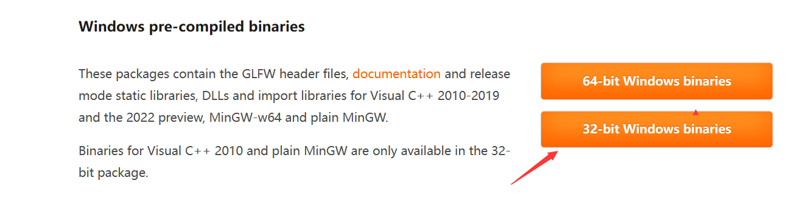
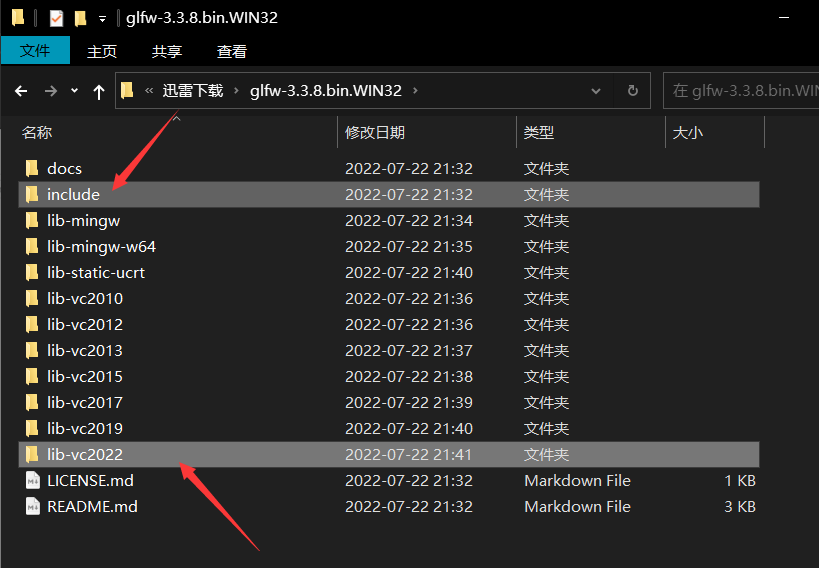
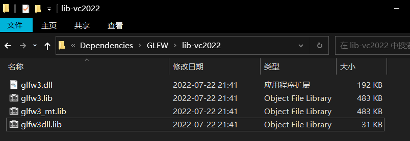
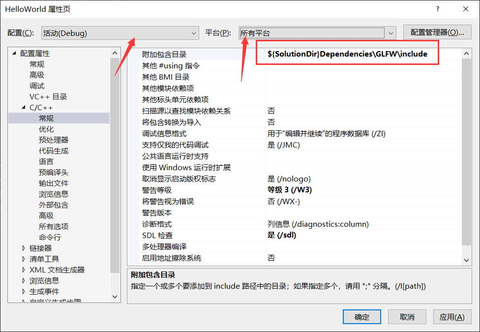
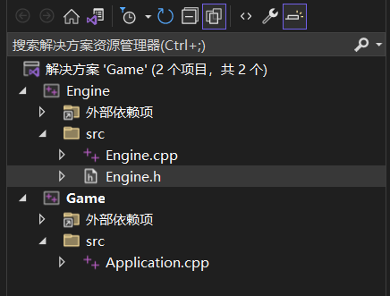
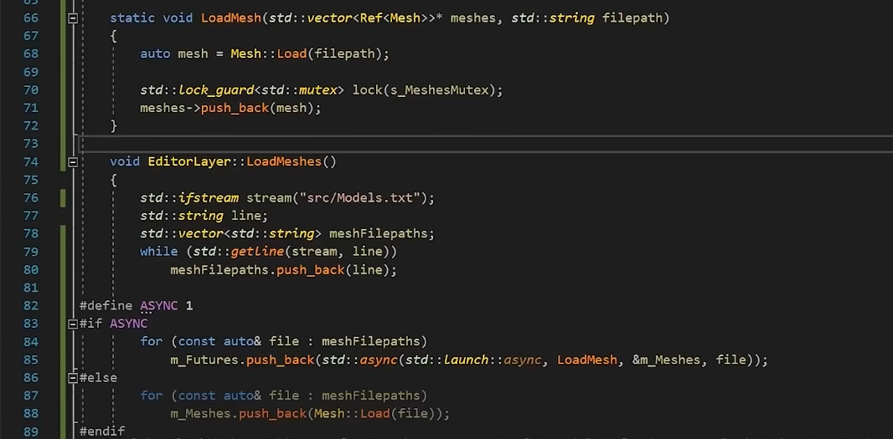

# Cherno CPP学习笔记

### 0、工具网站收集

C++语言版本特性 

https://en.cppreference.com

https://www.cplusplus.com

https://www.tutorialspoint.com/cplusplus

https://www.learncpp.com

https://github.com/fffaraz/awesomecpp

https://stackoverflow.com

网页CPP编译器

[[C++\] gcc 12.1.0 - Wandbox](https://wandbox.org/)

### 1.2、开始

#### P1、欢迎来到C++

C#、Java是在虚拟机上运行的，意味着代码首先编译成一种中间语言，当在目标平台上运行应用程序时，先运行虚拟机，再转换成机器码

C++直接操控硬件，C++编译器为目标平台和目标架构直接生成机器码

#### P2、环境安装（windows）

VS2017的安装教程

File->new project->Visual C++ ->General->Empty Project

然后起好名字、确定好路径就ok了

进入项目，在Solution Explorer中自己的Solution下的Source File->add->new Item

#### P5、C++是如何工作的

#符号后面都是预处理语句，编译器会首先处理（编译发生之前）

main函数比较特殊，不一定非要返回值（没写的话默认返回0）

```c++
#include<iostream>

int main() {
	std::cout << "hello World!" << std::endl;
	std::cin.get();

}
```

运行顺序：

* 编译器先处理“预处理语句”，即编译器先将iostream文件内容全部包含进来，可以理解为拷贝粘贴到自己的文件中
* 第二步，文件被编译，编译器将所有的C++代码转换为实际的机器代码。以VS配置为例：
  * 解决方案平台（默认Debug 和 x86或win32）
  * 配置只是构建项目的时候的一系列规则（右键解决方案->属性）
  * 解决方案是指你编译的代码的目标平台
  * x86的意思就目标平台为windows 32位，会生成32位的windows应用程序
  * 目标平台也可以是Android,但要确保配置和平台的正确
  * Debug和release的区别：默认Debug会更慢，release更追求速度。Debug关掉了很多优化以方便我们更好调试代码。
  * 配置类型是生成文件的格式.exe  .dll
  * 包括C/C++下的配置，**这些规则控制我们的文件如何被编译**
  * 在程序员的视角，编译只编译 .cpp文件，因为头文件被复制粘贴进 .cpp文件中了
  * 每一个cpp文件都被编译成了一个object file（目标文件），vs生成的文件后缀是.obj

* 然后，链接（link）将生成的.obj文件合并成一个执行文件： [How the C++ Linker Works ]( https://youtu.be/H4s55GgAg0I)
  * 单独编译一个文件，不会发生链接



PS： error list仅供参考，一般信息不全，建议看output 窗口。

link的一个例子 (使用声明)：

```c++
//main.cpp
#include<iostream>

void Log(const char* message);

int main() {
	Log("hello World");
	std::cin.get();

}
```

```c++
//log.cpp
#include<iostream>

void Log(const char* message) {
	std::cout << message << std::endl;
}
```

#### P6、C++编译器是如何工作的

编译原理既视感



相比其他语言，在C++里，文件变得没有意义

* Java里主类命要与 .java 名字一致，包名的命名层级关系，文件可以被看做是组成单元
* 但在C++里，文件更像是一种协议或者是约定，.cpp被视为c++文件， .c 被视为c文件， .h被视为头文件，不同的文件对应的“约定”不同。
* 编译器只是将一个cpp文件变成一个**翻译单元**，一个翻译单元会生成一个.obj文件，实际上cpp文件可以包含其他的cpp文件，最后也是一个翻译单元


一个成功编译的例子：（#include的复制粘贴）

```c++
int Mutiply(int a, int b)
{
    int result = a * b;
    return result;
#include "EndBrace.h"
```

```c++
//EndBrace.h
}
```


* 在项目属性->C/C++->Output Files->Assembler Output设置为/FA，编译之后就会生成一个.asm文件，内容为汇编指令。

* 在项目属性->C/C++->Optimization设置为Maximum Speed并且把Code Generation->Basic Runtime Checks设置成Default，编译之后再看.asm文件，发现文件相比之前的设置小了许多，这是因为编译器对代码做了优化。

### 1.5、继续（巫师3真好玩）

#### P7、C++链接器是如何工作的

链接的主要工作：找到每个符号和每个函数在哪里，并把他们连接起来。即把所有的.obj文件链接在一起。

链接过程常见错误：（错误代码LNK）

* 未解决的外部符号unresolved external symbol ： 连接器找不到他们需要的东西。


如果从来没有调用过某个函数（代码级），那么链接器不需要去链接这个函数。反之可能有例外：

static修饰的函数意味着这个函数只被声明在当前翻译单元中

```c++
//Main.cpp
//代码上Multiply函数中调用了Log函数，如果去链接Log函数将会出错
//但由于static的修饰,链接器判断Multiply函数将不可能被调用(本翻译单元内未调用+其他翻译单元不使用Mutiply)
//故编译和链接过程都不会出错。
//去掉static或者main中的注释//都会导致出错
#include<iostream>

void Log(const char* message);

static int Multiply(int a, int b){
	Log("Multiply");
	return a * b;
}

int main() {
	//std::cout << Multiply(5, 8) << std::endl;
	std::cin.get();
}
```

```c++
//Log.cpp
#include<iostream>

void LogR(const char* message) {
	std::cout << message << std::endl;
}

```

* **静态链接**
* **动态链接**

#### P8、C++变量

核心思想，不同变量之间的区别是分配的空间大小。

#### P9、C++函数

没什么东西

#### P10、C++头文件

#pragma once在头文件中的作用：

* 告诉编译器这个头文件只被编译一次
* 尤其防止 .h 文件中出现结构体重复编译将会报错

另一种做法做法：（头文件保护符）

```c++
#ifndef _LOG_H
#define _LOG_H

void Log(const char* message);
void InitLog();
struct Player{};

#endif
```


#include 尖括号<>和引号""的区别：

* 如果要包含的文件在其中一个文件夹里，用尖括号告诉编译器搜索包含路径的文件夹
* 引号通常用于包含相对于当前文件的文件，但引号其实可以做一切。

#### P11、如何在Visual Studio中调试

在debug模式下，内存视图中值为 0xCC 的内存为未初始化的栈空间

### 1.7、懒狗继续学习

#### P12、if语句

**汇编指令视图**：在debug模式下，运行到断点之后可以右键代码区->转到反汇编（Go To Disassembly）

const char* ptr 可以与字符串直接判等 如：if ( ptr=="hello" )

#### P13、Visual Studio的最佳设置

**过滤视图和磁盘目录结构**：

* VS中解决方案下的文件夹是虚拟的，起一个过滤的作用，但在磁盘上不存在



* 通过点击显示所有文件，解决方案下的文件树会变成磁盘的实际样子。
  * 在此视图下新建文件夹就可以了
* 解决方案属性里面设置的路径都是基于项目文件vcsproj来说的
* 这里所作配置：
  * 解决方案属性->平台选择所有平台->常规里输出目录设置为`  $(SolutionDir)\bin\$(Platform)\$(Configuration)\`
  * 中间目录设置为` $(SolutionDir)\bin\intermediates\$(Platform)\$(Configuration)\  `

#### P14、C++循环（for 、while）

没什么东西

#### P15、C++控制流语句（continue, break, return）

没什么东西

#### P16、C++指针

C++11关键字nullptr

在debug模式下，运行到断点之后可以查看内存视图，也可以查看特定内存地址的方法：

* 菜单栏  调试->窗口->内存

#### P17、C++引用

* 引用通常只是指针的伪装。

* 引用必须去“引用”已经存在的变量，引用本身不是新的变量，引用并不占用内存，没有真正的存储空间。

* 别名。声明时赋值

#### P18、C++类

数据和功能组合在一起的一种方法。

没什么东西

### 1.11、一天打渔，三天晒网

#### P19、C++类与结构体对比

主要区别：可见度 visiablity

* class 默认是private；而struct默认是public

C++中的struct主要是为了兼容C

#### P20、如何写一个C++类

日志类为例：

* 日志信息的三个级别：error、warning、message/trace

* 日志系统级别：error、warning、message/trace，设置之后起信息过滤的作用。

```c++
#include<iostream>
//命名习惯和类内分块习惯
class Log 
{
public:
	const int LogLevelError = 0;
	const int LogLevelWarning = 1;
	const int LogLevelInfo = 2;
private:
	int m_LogLevel = LogLevelInfo;
public:
	void SetLogLevel(int LogLevel) 
	{
		m_LogLevel = LogLevel;
	}
	void Warning(const char* message) 
	{
		if (m_LogLevel >= LogLevelWarning)
			std::cout << "[Warning]: " << message << std::endl;
	}
	void Error(const char* message)
	{
		if (m_LogLevel >= LogLevelError)
			std::cout << "[Error]: " << message << std::endl;
	}
	void Info(const char* message)
	{
		if (m_LogLevel >= LogLevelInfo)
			std::cout << "[Info]: " << message << std::endl;
	}
};

int main() {
	Log log;
	log.SetLogLevel(log.LogLevelWarning);
	log.Info("hello");
	log.Error("hello");
	log.Warning("hello");
	std::cin.get();
}
```

#### P21、C++中的静态（static）

含义：

* 在类或结构体**外部**使用static关键字：
  * static修饰的符号（变量/函数），只在内部链接，该符号只在翻译单元可见
* 在类或结构体**内部**使用static关键字：
  * static修饰的变量与类的所有实例共享内存（单例）


讨论在类或结构体**外部**使用static关键字：

* 如两个.cpp都有一个全局变量`int s_varible;`，链接阶段会报错：already defined。
  * 将其中一个cpp修饰 `static int s_varible;`，链接阶段不会报错
    * static的作用类似于private
  * 或者将其中一个cpp修饰`extern int s_varible;` ，意为在外部翻译单元中寻找s_varible；【external linking】
    * 此时没有extern修饰的`int s_varible;`才是本体。

#### P22、C++类和结构体中的静态（static）

由于单例的特性，静态方法无法访问类的实例。

静态方法可以通过类名被调用，在静态方法内部，不能写引用到类实例的代码。

#### P23、C++中的局部静态（Local Static）

生存期指的是变量实际存在的时间；作用域指我们可以访问变量的范围；

Local Static允许我们声明一个变量，它的生存期基本相当于整个程序的生存期，然而它的作用范围被限制在这个作用域（函数、if等）内。

函数作用域中的static和类作用域中的static之间的对比：

* 生存周期相同
* 在类的作用域中，类中任何东西都可以访问这个静态变量；
* 在函数作用域中声明一个静态变量，它将是函数的局部变量。

```c++
#include<iostream>
//不使用局部静态的一种单例实现（饿汉）
class Singleton
{
private:
	static Singleton* s_Instance;
public:
	static Singleton& Get() { return *s_Instance; }
	void Hello() {}
};
Singleton* Singleton::s_Instance = nullptr;
int main() {
	Singleton::Get().Hello();
	std::cin.get();
}
```

```c++
#include<iostream>
//使用局部静态的一种单例实现(懒汉)
class Singleton
{
public:
	static Singleton& Get() 
	{ 
		static Singleton instance;
		return instance; 
	}
	void Hello() {}
};
int main() {
	Singleton::Get().Hello();
	std::cin.get();
}
```


#### P24、C++枚举

注意语法和特性

```c++
enum Example : unsigned char
{
	A = 5, B, C
};
```

```c++
#include<iostream>
//使用枚举优化P20代码,注意枚举不是一个作用域
class Log
{
public:
	//const int LogLevelError = 0;
	//const int LogLevelWarning = 1;
	//const int LogLevelInfo = 2;
    //修改部分***
	enum Level 
	{
		LogLevelError = 0, LogLevelWarning, LogLevelInfo
	};
    //修改部分***
private:
	int m_LogLevel = LogLevelInfo;
public:
	void SetLogLevel(int LogLevel)
	{
		m_LogLevel = LogLevel;
	}
	void Warning(const char* message)
	{
		if (m_LogLevel >= LogLevelWarning)
			std::cout << "[Warning]: " << message << std::endl;
	}
	void Error(const char* message)
	{
		if (m_LogLevel >= LogLevelError)
			std::cout << "[Error]: " << message << std::endl;
	}
	void Info(const char* message)
	{
		if (m_LogLevel >= LogLevelInfo)
			std::cout << "[Info]: " << message << std::endl;
	}
};

int main() {
	Log log;
	log.SetLogLevel(log.LogLevelWarning);
	log.Info("hello");
	log.Error("hello");
	log.Warning("hello");
	std::cin.get();
}
```

#### P25、C++构造函数

Java类中的变量会被默认赋默认值，而C++不会

删除默认构造函数可以声明private的构造函数 or Entity = delete；


#### P26、C++析构函数

主动调用析构函数并不会释放资源（删除当前对象）。

### 1.12、再打一天渔吧

#### P27、C++继承

讲了一些思想，还是挺好的，就不记了。

#### P28、C++虚函数

虚函数引入了一种叫做Dynamic Dispatch （动态联编）的机制，通常通过虚函数表（v表）来实现编译。

* 虚函数表就是一个表，包含所有基类中所有虚函数的映射，这样我们在运行时可以将他们映射到正确的覆写（override）函数

* 虚函数有额外开销。一方面，需要额外的内存来存储v表，这样我们就可以分配到正确的函数，包括基类中要有一个成员指针，指向v表；另一方面，每次调用虚函数时，我们需要遍历这个表，来确定要映射到哪个函数。


为什么需要虚函数的一个例子：

```c++
#include<iostream>
#include<string>
//这里不使用虚函数
class Entity 
{
public:
	std::string GetName() { return "Entity"; }
};

class Player : public Entity
{
private:
	std::string m_name;
public:
	Player(const std::string& name)
		: m_name(name) {}

	std::string GetName() { return m_name; }
};
int main() {
	
	Entity* e = new Entity();
	std::cout << e->GetName() << std::endl;
	Player* p = new Player("Cherno");
	std::cout << p->GetName() << std::endl;
	//输出：
	//Entity
	//Cherno

	Entity* entity = p;
	std::cout << entity->GetName() << std::endl;
	//输出：
	//Entity  
	//无法实现多态原因：我们在声明函数时，我们的方法通常在类内部起作用。
	//当要调用方法的时候，会调用属于该类型的方法

	std::cin.get();
}
```

用虚函数改进仅需要将Entity类的方法返回值前加上virtual关键字

```c++
class Entity 
{
public:
	virtual std::string GetName() { return "Entity"; }
};
```

同时最好将Player类中对应的方法加上override  **（C++11特性）**，防止拼写错误

```c++
std::string GetName() override { return m_name; }
```


#### P29、C++接口（纯虚函数）

纯虚函数允许我们在基类中定义一个没有实现的函数，然后强制子类去实现该函数。


实现语法：

```c++
class Entity 
{
public:
	virtual std::string GetName() = 0;
};
```


一个例子：（GetClassName接口）

```c++
#include<iostream>
#include<string>

class Printable
{
public:
	virtual std::string GetClassName() = 0;
};

class Entity : public Printable
{
public:
	std::string GetClassName() override { return "Entity"; }
};

class Player : public Entity
{
public:
	std::string GetClassName() override { return "Player"; }
};

void Print(Printable* obj) 
{
	std::cout << obj->GetClassName() << std::endl;
}

int main() {
	
	Entity* e = new Entity();
	Player* p = new Player();
	Entity* entity = p;
	
	Print(e);
	Print(p);
	Print(entity);

	//输出：
	//Entity
	//Player
	//Player
	std::cin.get();
}
```


#### P30、C++可见性

可见性是属于面向对象编程的概念，它指的是类的某些成员或方法实际上有多可见：谁能看见他们、谁能调用他们、谁能使用它们；

C++中有三个基础的可见性修饰符：（Java中还有default、C#中有internal）

* private：只有这个类本身能访问所修饰的符号，友元除外。
  * friend是C++关键字，它可以让类或者函数成为类的朋友（友元），可以从类中访问私有成员。
* protect：只有这个类本身和层次结构中的所有子类可以访问所修饰的符号，==友元除外？==

* public：公开访问。

#### P31、C++数组

C++11库中有标准数组std::array，优点有边界检查、记录数组大小等。

堆区new出来的数组，对指针使用sizeof()没有意义。所以很多情况下需要我们自己维护数组的大小。

如果在类中申请栈上的数组：

```c++
static const int exampleSize = 5;
int example[exampleSize];
```

使用std::array：

```c++
#include <array>

std::array<int, 5> another;
int size = another.size();
```


#### P32、字符串

没什么东西，不如学STL。

### 1.13、三天打渔

#### P33、C++字符串字面量

字符串字面量，是在双引号之间的一串字符。

字符串字面量永远保存在内存中的只读区域内

```c++
char name[] = "Cherno";
//在汇编模式中，‘Cherno’被保存到只读区，name指针保存的是一个只读区的地址。
name[2] = 'a';
//如果要修改，寄存器会复制只读区的'Cherno'到name变量中，产生了额外开销。（不能直接修改只读区的内存）
```


VS的编译器是MSVC。


```c++
//一个字节的字符 utf8
const char* name = u8"Cherno";

//宽字符wchar_t windows上是2字节，linux上是4字节，mac也是4字节？
const wchar_t* name1 = L"Cherno";

//两个字节的字符 utf16
const char16_t* name2 = u"Cherno";

//四个字节的字符 utf32
const char32_t* name3 = U"Cherno";
```

```c++
//原版
std::string name0 = (std::string)"hello" + ", Alice";

//C++14新特性
using namespace std::string_literals;
std::string name1 = "hello"s + ", Alice";

std::wstring name2 = L"hello"s + L", Alice";

std::u16string name3 = u"hello"s + u", Alice";

std::u32string name4 = U"hello"s + U", Alice";

	//原版
	const char* example = "line1\n"
		"line2\n"
		"line3\n";

	//C++14新特性  R()忽略转义字符
	const char* ex = R"(line1
		line2
		line3)";
```

#### P34、C++中的CONST


```c++
const int* a = new int;
//星号前，不能修改指针指向的内容 如： *a = 2;

int* const a = new int;
//星号后，不能修改指针的指向 如 a = &b;
```


```c++
class Entity
{
private:
	int m_x, m_y;
    mutable int var;
public:
    //类中方法括号后的const意为这个方法不会修改任何实际的类，只能读，不能写;mutable修饰的变量除外
	int GetX() const
	{
		//m_x = 2; 不被允许
        var = 2; //可以
		return m_x;
	}
    int GetX()
	{
		return m_x;
	}
    
};

//参数const约定不修改e的内容, &防止拷贝，优化性能
void PrintEntity(const Entity& e)
{
    //此处必须调用带const修饰的GetX函数
	std::cout << e.GetX() << std::endl;
}
```


#### P35、C++的mutable关键字

mutable标记一个变量，意味着类中的const方法可以修改这个成员。

mutable的用途：

* 与const一起使用，如P34中，想要统计GetX()的调用次数，最好设置一个成员 mutable int cnt;
* 在lambda表达式中使用


```c++
//使用mutable修饰lambda表达式允许传值的条件下修改内部x的值,但此时外部x的值没有改变
int x = 8;
auto f = [=]() mutable
{
	x++;
    std::cout << x << std::endl;
}

f();
//x == 8; 
```

#### P36、C++的成员初始化列表

语法：

```c++
class Entity
{
private:
	std::string m_Name;
	int m_x, m_y;
public:
	//初始化列表中最好按照声明的顺序写，防止警告
	Entity()
		:m_Name("Unkonwn"),m_x(0),m_y(5)
	{
	}
	Entity(const std::string& name)
		:m_Name(name)
	{
	}

};
```


* 便于维护易读性：函数体内部可能会有Init之类的其他操作；

* 提升性能：

```c++
#include<iostream>
#include<string>
class Example
{
public:
	Example()
	{
		std::cout << "Create Example !" << std::endl;
	}
	Example(int x)
	{
		std::cout << "Create Example with" << x << std::endl;
	}
};

class Entity
{
private:
	std::string m_Name;
	Example m_Example;
public:
	//初始化列表中最好按照声明的顺序写，防止警告
	Entity()
	{
		m_Name = "Unknown";
		m_Example = Example(8);
	}
	Entity(const std::string& name)
		:m_Name(name), m_Example(Example(8))
	{
	}

};

int main() {
	Entity e1;
	//输出：
	//Create Example !
	//Create Example with8
	
	Entity e2("Cherno");
	//输出：
	//Create Example with8

	std::cin.get();
}
```

```c++
//不使用初始化列表的情况，在Entity构造函数中相当于：
Entity()
	{
    	Example m_Example;
		m_Name = "Unknown";
		m_Example = Example(8);
	}
//会有两次Example的构造过程

//而使用初始化列表相当于声明的时候就赋初值：
Example m_Example = Example(8);
//故只调用一次
```

#### P37、C++的三元操作符

？： 没什么东西

#### P38、 创建并初始化C++对象

栈上创建还是堆上创建。

* 如果对象很大，或者想要显式地控制对象地生存期，在堆上创建。
  * 需要手动delete，忘了就内存泄漏
  * 智能指针可以自动delete。（在没有引用时）

* 反之在栈上创建。（栈大小一般只有几M）

#### P39、C++ new关键字


```C++
//malloc做的仅仅是分配内存，然后给我们一个指向那个内存的指针（C++中不推荐使用）
Entity* e = (Entity*)malloc(sizeof(Entity)) ;
//new相比malloc多做的是调用了构造函数
Entity* e = new Entity();
```

#### P40、C++隐式转换与explicit关键字

隐式的意思是，不会明确地告诉他要做什么，有点像自动，通过上下文知道意思。

C++允许编译器对代码进行一次隐式转换。

如果我们开始有一个数据类型，然后有另一种类型，在两者之间，C++允许隐式进行转换，而不需要用cast做强制转换。

```c++
class Entity
{
private:
	std::string m_Name;
	int m_Age;
public:
	Entity(int age)
	:m_Name("Cherno"),m_Age(age) {}

	Entity(const std::string& name)
		:m_Name(name),m_Age(-1) {}

};

void PrintEntity(const Entity& entity)
{
	//Printing
}

int main() {
	Entity e1(22);
	Entity e2("Cherno");
	//隐式转换 或者称为 隐式构造函数
	Entity e3 = 22;
	Entity e4 = (std::string)"cherno";

	//另一种隐式转换
	PrintEntity(22);
    
	std::cin.get();
}
```

explicit关键字：禁用隐式转换的功能

* explicit关键字放在构造函数前面，表示不能隐式转换，必须显式调用此构造函数
* 例子略

#### P41、C++运算符及其重载

运算符：

* 加减乘除、逆向引用、箭头、+=、&、<<、new、delete、逗号、括号等

```c++
class Vector2
{
public:
	float x, y;
	Vector2(float x, float y) : x(x), y(y) {}
	Vector2 operator+(const Vector2& other) const
	{
		return Vector2(x + other.x, y + other.y);
	}
	Vector2 operator*(const Vector2& other) const
	{
		return Vector2(x * other.x, y * other.y);
	}
	bool operator==(const Vector2& other)
	{
		return x == other.x && y == other.y;
	}
};

std::ostream& operator<<(std::ostream& stream, Vector2& vector)
{
	stream << vector.x << " ," << vector.y << std::endl;
	return stream;
}
int main() {
	Vector2 position(4.0f, 4.0f);
	Vector2 speed(0.5f, 1.5f);
	Vector2 powerUp(1.1f,1.1f);

	Vector2 result = position + speed * powerUp;
	std::cout << result << std::endl;

	std::cin.get();
}
```

#### P42、C++的this关键字

没什么东西。

#### P43、C++的对象生存期（栈、作用域、生存期）

作用域Scope：

* if作用域、for、while、空作用域、类作用域

**智能栈指针？一个例子：（离开作用域后自动被销毁）其他用途：计时器timer、互斥锁mutex locking 等。**

```c++
class Entity
{
public:
	Entity() { std::cout << "Created Entity!" << std::endl; }
	~Entity() { std::cout << "Delete Entity!" << std::endl; }
};

class ScopePtr
{
private:
	Entity* m_Ptr;
public:
	ScopePtr(Entity* entity) :m_Ptr(entity) {}
	~ScopePtr()
	{
		delete m_Ptr;
	}
};

int main() {
	{
		//ScopePtr对象e是在栈上分配的，e如果被删除，析构函数删除Entity对象
		ScopePtr e = new Entity();
	}

	std::cin.get();
}
```

#### P44、C++的智能指针

智能指针是自动实现new和delete操作的一种方式。当你new之后不需要delete，甚至不用new。

本质上是一个原始指针的一个包装。

**第一个智能指针：unique_ptr：作用域指针**

```c++
//unique_ptr不能被copy，防止二次释放
class Entity
{
public:
	Entity() { std::cout << "Created Entity!" << std::endl; }
	~Entity() { std::cout << "Delete Entity!" << std::endl; }
	void Print() { std::cout << "Print" << std::endl; }
};

class ScopePtr
{
private:
	Entity* m_Ptr;
public:
	ScopePtr(Entity* entity) :m_Ptr(entity) {}
	~ScopePtr()
	{
		delete m_Ptr;
	}
};

int main() {
	{
		//智能作用域指针unique_ptr
		std::unique_ptr<Entity>entity(new Entity());
		//std::unique_ptr<Entity>entity = new Entity();  不能这样因为explicit修饰
		/*
			template <class _Dx2 = _Dx, _Unique_ptr_enable_default_t<_Dx2> = 0>
			_CONSTEXPR23 explicit unique_ptr(pointer _Ptr) noexcept 
			: _Mypair(_Zero_then_variadic_args_t{}, _Ptr) {}
		*/
		//更推荐的做法：(如果构造函数抛出异常，这种方法更安全）
		std::unique_ptr<Entity>entity2 = std::make_unique<Entity>();

		//entity2 = entity; 不能copy，因为unique_ptr的拷贝构造函数被删除了

		entity->Print();
	}

	std::cin.get();
}
```

**引用计数指针：shared_ptr：引用计数可以跟踪指针有多少个引用，一旦引用计数达到0，他就被删除了。**

```c++
std::shared_ptr<Entity> entity = std::make_shared<Entity>(); 	//更推荐使用
std::shared_ptr<Entity> entity(new Entity());
```

* shared_ptr需要额外分配一块内存，叫做控制块，用来存储引用计数。
* 如果首先创建一个new Entity，然后将其传递给shared_ptr构造函数，他必须做两次内存分配，
  * 先做一次new Entity，然后是shared_ptr的控制内存块的分配。
  * 如果把他们组合起来会更有效率。

```c++
	{
		std::shared_ptr<Entity> e0;
		{
			std::shared_ptr<Entity> entity = std::make_shared<Entity>();
			e0 = entity;
		}//此处entity不释放，因为还有e0在引用它
	}//e0回收，entity将在此处被释放
```

**弱指针：weak_ptr：与shared_ptr一起使用，但不会增加shared_ptr的引用计数**

```c++
	{
		std::weak_ptr<Entity> w0;
		{
			std::shared_ptr<Entity> entity = std::make_shared<Entity>();
			w0 = entity;//不会增加引用计数
		}//此处entity释放
        //可以随时使用weak_ptr的方法查看是否过期
	}
```

### 1.14、打渔！

#### P45、C++的复制与拷贝构造函数

**一个好习惯：通过const 引用来传递对象**

拷贝是指要求复制数据，即复制内存。

* 当我们想要把一个对象或原语或一段数据从一个地方复制到另一个地方时，我们实际上有两个副本。
* 拷贝需要时间，如果尽可能避免多余的拷贝（复制），可以提升性能。

```c++
class String
{
private:
	char* m_Ptr;
	unsigned int m_Size;
public:
	String(const char* s)
	{
		m_Size = strlen(s);
		m_Ptr = new char[m_Size + 1];
		memcpy(m_Ptr, s, m_Size);
		m_Ptr[m_Size] = 0;

	}
	~String() 
	{
		delete[] m_Ptr;
	}
	//深拷贝
	String(const String& other)
		: m_Size(other.m_Size)
	{
		m_Ptr = new char[m_Size + 1];
		memcpy(m_Ptr, other.m_Ptr, m_Size + 1);
	}


	char& operator[](int index)
	{
		return m_Ptr[index];
	}

	friend std::ostream& operator<<(std::ostream& stream, const String& str);
};

std::ostream& operator<<(std::ostream& stream, const String& str)
{
	stream << str.m_Ptr;
	return stream;
}

int main() {
	String string = "Cherno";
	String second = string;   

	second[2] = 'a'; 

	std::cout << string << std::endl;
	std::cout << second << std::endl;
	std::cin.get();
	//浅拷贝的话会运行崩溃
}
```

**C++会默认提供一个拷贝构造函数，像如下两种（效果一样）**

```c++
String(const String& other)
		:m_Ptr(other.m_Ptr), m_Size(other.m_Size){}


String(const String& other)
{
    memcpy(this, &other, sizeof(String));
}
```

#### P46、C++的箭头操作符

重载一下：

```c++
class Entity
{
public:
	Entity() { std::cout << "Created Entity!" << std::endl; }
	~Entity() { std::cout << "Delete Entity!" << std::endl; }
	//这里的const 可以让const ScopePtr 返回 const Entity* 最后调用此方法
	void Print() const 
	{
		std::cout << "Print" << std::endl; 
	}
};
class ScopePtr
{
private:
	Entity* m_Ptr;
public:
	ScopePtr(Entity* entity) :m_Ptr(entity) {}
	~ScopePtr()
	{
		delete m_Ptr;
	}

	Entity* operator->() 
	{
		return m_Ptr;
	}
	const Entity* operator->() const
	{
		return m_Ptr;
	}
};

int main() {
	{
		ScopePtr entity = new Entity();
		entity->Print();

		const ScopePtr con = new Entity();
		con->Print();
	}

	std::cin.get();
}
```

**利用->获取内存中某个值的偏移量：**

* 当把数据序列化一串字节流，想要计算某些东西的偏移量时很有用。（处理字节流）

```c++
struct Vector3
{
	float x, y, z;
};

int main()
{
	int offset = (int)&((Vector3*) nullptr)->y;
	std::cout << offset << std::endl;   //4
	std::cin.get();
}
```

#### P47、C++的动态数组（std::vector）

没什么东西。

#### P48、C++的std::vector使用优化

问题：

```c++
class Vertex
{
public:
	float x, y, z;
	Vertex(float x, float y, float z)
		:x(x), y(y), z(z){}
	Vertex(const Vertex& vertex)
		:x(vertex.x), y(vertex.y), z(vertex.z) 
	{
		std::cout << "Copied!" << std::endl;
	}

};

int main()
{
	std::vector<Vertex> vertexs;
	vertexs.push_back({ 1,2,3 });//1次copy，将main栈中copy到vertexs中
	vertexs.push_back({ 4,5,7 });//2次copy，扩容
	//等价上面的方法
	vertexs.push_back(Vertex(6, 6, 6));//3次copy，扩容
	//共copy次数为6次

	std::cin.get();
}
```

**改进1、reserve：预留空间但不构造**

```c++
std::vector<Vertex> vertexs;
vertexs.reserve(3);
vertexs.push_back({ 1,2,3 });//1次copy
vertexs.push_back({ 4,5,7 });//1次copy
//等价上面的方法
vertexs.push_back(Vertex(6, 6, 6));//1次copy
//共3次copy
```

**改进2、emplace_back：直接传参数列表，免去main栈到vertexs过程的copy**

```c++
std::vector<Vertex> vertexs;
vertexs.reserve(3);
//注意传参
vertexs.emplace_back(1,2,3);//0次copy
vertexs.emplace_back(4,5,7);//0次copy
vertexs.emplace_back(6, 6, 6);//0次copy
```

#### P49、C++中使用库（静态链接）

库通常包括两部分：includes和library

* include目录是一堆我们需要使用的头文件
* lib目录有那些预先构建的二进制文件


GLFW提供了动态库和静态库，可以选择**动态链接 or 静态链接。**

**主要区别是库文件是否被编译/链接到 .exe文件中。**

* 静态链接意味着这个库会被放到你的.exe可执行文件中，或其他操作系统下的可执行文件
* 动态链接库是在运行时链接的，在程序运行时你可以动态装载一些链接
  * 如windows API中的loadLibrary【没见过】
  * 你也可以在程序启动时加载 .dll文件，这就是动态链接库。

* 静态链接是在编译时发生的
* 动态链接是在运行时发生的
  * 意味着只有当真正启动可执行文件时，动态链接库才会被加载


静态链接在技术上可以产生更快的应用程序，因为它允许更多的优化发生

* 链接时我们知道如何去只链接我们需要的函数。
* 动态库必须保持它的完整。


练手操作：

```c++
1、配置编译头文件：
glfw.org官网下载32-bit的链接库
在.sln文件所在文件夹下创建Dependencies文件夹
进入Dependencies文件夹，创建GLFW文件夹
将include和lib-vc2022复制到该文件夹（其实版本无所谓）
    lib-vc2022中glfw3.lib是和glfw3dll.lib一起使用的
    后者包含了前者所有的函数、符号的位置，所以可以在编译时链接它【不懂】
在vs项目属性->c/c++ -> general(常规)填写附加包含目录：
    $(SolutionDir)Dependencies\GLFW\include
    其中$(SolutionDir)是.sln文件所在目录的宏
然后就可以在项目中使用  #include "GLFW/glfw3.h"
```











```c++
#include<iostream>
#include "GLFW/glfw3.h"

int main()
{
	int a = glfwInit(); //此时可以通过编译，但还没有链接

	std::cin.get();
}
```

继续：

```c++
2、配置linker
右键项目属性->链接器->输入
在附加依赖项中添加glfw3.lib;
在链接器->常规->附加目录库键入
    $(SolutionDir)Dependencies\GLFW\lib-vc2022
链接成功 a值为1
```

另一种使用方法：

```c++
#include<iostream>
//加extern "C" 的原因是glfw实际上是一个C语言库
//语言混用导致混淆名字（Name-mangling）【不懂】
extern "C" int glfwInit();

int main()
{
	int a = glfwInit();

	std::cin.get();
}
```

#### P50、C++中使用动态库（动态链接）

==有个小课后作业==

```c++
右键项目属性->链接器->输入
在附加依赖项中添加glfw3dll.lib;  //删掉原来的glfw3.lib;
//此时直接运行会报错缺少.dll
需要将glfw3.dll文件复制到HelloWorld\bin\Win32\Debug\下，即与HelloWorld.exe同目录
```

```c++
#include<iostream>
#include<GLFW/glfw3.h>

int main()
{
	int a = glfwInit();
	std::cout << a << std::endl;  //1
	std::cin.get();
}
```

#### P51、C++中创建与使用库（VisualStudio多项目）

```c++
新建一个解决方案Game,会默认创建一个项目Game
在解决方案下新建项目Engine，配置Engine属性->常规->配置类型为 静态库(.lib)
    可以直接选择配置所有配置所有平台
设置Game项目的属性->C/C++ ->常规附加包含目录
    $(SolutionDir)Engine\src;
右键Game项目添加引用，选择Engine
```

项目展示：




```c++
//Engine.h
#pragma once
namespace engine
{
	void PrintMessage();
}
```

```c++
//Engine.cpp
#include "Engine.h"
#include <iostream>
namespace engine
{
	void PrintMessage()
	{
		std::cout << "HelloWorld!" << std::endl;
	}
}
```

```c++
//Application.cpp
//#include "../../Engine/src/Engine.h"
#include "Engine.h"
#include<iostream>
int main()
{
	engine::PrintMessage();
	std::cin.get();
}
```

#### P52、C++中如何处理多返回值


* 返回**结构体(推荐)** or array、vector、pair、tuple 
  * array在栈上创建（更快），vector在堆上创建
* 传参指针or引用

```c++
std::tuple<std::string, std::string> function()
{
	string fs = "ss";
    string ts = "tt";
    return std::make_pair(fs,ts);
}

auto source = function();
std::string fs = std::get<0>(source);
```

```c++
std::pair<std::string, std::string> function()
{
	string fs = "ss";
    string ts = "tt";
    return std::make_pair(fs,ts);
}

auto source = function();
std::string fs = source.first;
```

```c++
//结构体  推荐
struct ShaderSource
{
    std::string VertexSource;
    std::string FregmentSource;
}
function()
{
	string fs = "ss";
    string ts = "tt";
    return {fs,ts};
}
```

### 1.15、摸鱼！

#### P53、C++的模板

C++的模板对标其他语言中的“泛型”。（C#、Java）

templete 允许你定义一个可以根据你的用途进行编译的模板，可以让编译器基于一套规则帮你写代码。

模板本身不存在，直到我们调用它，它才会去创建一个函数。

```c++
template<typename T>
//或者 template<class T>
void Print(T value)
{
	std::cout << value << std::endl;
}

int main()
{
	Print<int>(5);
	Print(5.5f);
	Print("hello");

	std::cin.get();
}
```

MSVC编译器不会对你不使用的模板进行报错；Clang会报错。

模板会在编译期被评估处理，所以可以利用模板实现“动态大小”的栈数组；

```c++
template<int N>
class Array
{
private:
	int m_Array[N];
public:
	int GetSize() const { return N; }
};

int main()
{
	Array<5> array;
	std::cout << array.GetSize() << std::endl;

	std::cin.get();
}
```

 **可以进一步添加typename，使类中成员类型可变，有点像“元编程”；**

```c++
template<typename T, int N>
class Array
{
private:
	T m_Array[N];
public:
	int GetSize() const { return N; }
};

int main()
{
	Array<int, 5> array;
	std::cout << array.GetSize() << std::endl;

	std::cin.get();
}
```

游戏引擎中的日志系统、材质系统可以使用模板。

#### P54、C++的堆与栈内存的比较

栈和堆都在内存RAM中，所处位置一样。

* 栈内存分配
  * 移动栈指针，返回栈指针的地址。仅此而已。仅一条CPU指令

* 堆内存分配
  * 当启动程序时，程序会得到一定物理大小的RAM，程序会维护一个空闲列表的东西，它跟踪哪些内存块是空闲的，以及它们在哪里。
  * 当需要动态内存的时候，使用malloc请求堆内存，程序可以浏览空闲列表，找到满足要求的内存块，返回指针。
  * 同时记录分配内存的大小，分配情况等。
  * 如果请求的内存大小超过了空闲列表所拥有的，即超过了操作系统给程序的初始分配。
    * 这个时候你的程序需要询问你的操作系统，嘿，我需要更多的内存


```c++
int main()
{
	int value = 5;
	int* hvalue = new int;

	int* harray = new int[5];
	harray[0] = 1;
	harray[1] = 2;
	harray[2] = 3;
	harray[3] = 4;
	harray[4] = 5;

	delete hvalue;
	delete[] harray;

	std::cin.get();
}
```

汇编源码：

```commonlisp
; 8    : 	int value = 5;

	mov	DWORD PTR _value$[ebp], 5

; 9    : 	int* hvalue = new int;

	push	4
	call	??2@YAPAXI@Z				; operator new
	add	esp, 4
	mov	DWORD PTR $T4[ebp], eax
	mov	eax, DWORD PTR $T4[ebp]
	mov	DWORD PTR _hvalue$[ebp], eax

; 10   : 
; 11   : 	int* harray = new int[5];

	push	20					; 00000014H
	call	??_U@YAPAXI@Z				; operator new[]
	add	esp, 4
	mov	DWORD PTR $T3[ebp], eax
	mov	eax, DWORD PTR $T3[ebp]
	mov	DWORD PTR _harray$[ebp], eax

; 12   : 	harray[0] = 1;

	mov	eax, 4
	imul	ecx, eax, 0
	mov	edx, DWORD PTR _harray$[ebp]
	mov	DWORD PTR [edx+ecx], 1

; 13   : 	harray[1] = 2;

	mov	eax, 4
	shl	eax, 0
	mov	ecx, DWORD PTR _harray$[ebp]
	mov	DWORD PTR [ecx+eax], 2

; 14   : 	harray[2] = 3;

	mov	eax, 4
	shl	eax, 1
	mov	ecx, DWORD PTR _harray$[ebp]
	mov	DWORD PTR [ecx+eax], 3

; 15   : 	harray[3] = 4;

	mov	eax, 4
	imul	ecx, eax, 3
	mov	edx, DWORD PTR _harray$[ebp]
	mov	DWORD PTR [edx+ecx], 4

; 16   : 	harray[4] = 5;

	mov	eax, 4
	shl	eax, 2
	mov	ecx, DWORD PTR _harray$[ebp]
	mov	DWORD PTR [ecx+eax], 5

; 17   : 
; 18   : 	delete hvalue;

	mov	eax, DWORD PTR _hvalue$[ebp]
	mov	DWORD PTR $T2[ebp], eax
	push	4
	mov	ecx, DWORD PTR $T2[ebp]
	push	ecx
	call	??3@YAXPAXI@Z				; operator delete
	add	esp, 8
	cmp	DWORD PTR $T2[ebp], 0
	jne	SHORT $LN3@main
	mov	DWORD PTR tv87[ebp], 0
	jmp	SHORT $LN4@main
$LN3@main:
	mov	DWORD PTR _hvalue$[ebp], 33059		; 00008123H
	mov	edx, DWORD PTR _hvalue$[ebp]
	mov	DWORD PTR tv87[ebp], edx
$LN4@main:

; 19   : 	delete[] harray;

	mov	eax, DWORD PTR _harray$[ebp]
	mov	DWORD PTR $T1[ebp], eax
	mov	ecx, DWORD PTR $T1[ebp]
	push	ecx
	call	??_V@YAXPAX@Z				; operator delete[]
	add	esp, 4
	cmp	DWORD PTR $T1[ebp], 0
	jne	SHORT $LN5@main
	mov	DWORD PTR tv90[ebp], 0
	jmp	SHORT $LN6@main
$LN5@main:
	mov	DWORD PTR _harray$[ebp], 33059		; 00008123H
	mov	edx, DWORD PTR _harray$[ebp]
	mov	DWORD PTR tv90[ebp], edx
$LN6@main:

; 20   : 
; 21   : 	std::cin.get();
```

#### P55、C++的宏

知识回顾：

* 当我们编译C++代码时，首先发生的事情是，**预处理器**会首先检查一遍所有以 **#** 开头的C++语句。
  * **#** 是预编译指令
* 当**预编译器**评估完代码后，会把评估后的代码给到**编译器**，进行实际的编译。

在预处理阶段，我们可以控制什么代码会实际喂给编译器，这就是**宏**的用武之地。

我们能做的就是写一些宏，它将代码中的文本替换为其他东西。

* 基本上就像遍历我们的代码然后执行查找和替换。==copy and paste==

宏与模板发生的时间不同：

* 模板评估的时间更晚一些；
* 宏只是预处理器的纯文本替换，在编译之前没有什么是不能被替换的。


```c++
//一个习惯不太好的例子
#define WAIT std::cin.get()

int main()
{
	WAIT;
}
```


```c++
#define LOG(x)  std::cout<< x <<std::endl

int main()
{
	LOG("hello");
}
```


**一个有用的例子：在debug模式下输出LOG信息，release模式下屏蔽LOG** 

分别在项目属性->C/C++  ->预处理器的Debug和Release配置下设置预处理器定义PR_DEBUG;和PR_RELEASE;

```c++
#ifdef PR_DEBUG
#define LOG(x)  std::cout<< x <<std::endl
#else
#define LOG(x)
#endif
int main()
{
	LOG("hello");
}

//不过更推荐用#if PR_DEBUG == 1的方法（#if更安全？）：需要设置预处理器定义PR_DEBUG=1;
//使用反斜杠\可以控制宏的换行
```

### 1.16、再摸！

#### P56、C++的auto关键字

auto让C++ “有点”变成了弱类型语言

* 强类型语言中必须指定类型。

如果改变了api，客户端调用api使用auto接收可以不用修改代码，但客户端可能会因为类型的改变而出错。

模板中常用auto，因为不得不。

**一个比较好的使用场景：(名字很长的类型的迭代)**

```c++
int main()
{
	std::vector<std::string> strings;
	strings.push_back("Apple");
	strings.push_back("Orange");
	strings.push_back("Banana");

	for (std::vector<std::string>::iterator it = strings.begin();
		it != strings.end(); it++)
	{
		std::cout << *it << std::endl;
	}

	for (auto it = strings.begin();
		it != strings.end(); it++)
	{
		std::cout << *it << std::endl;
	}

	std::cin.get();
}
//也可以用using XXX = std::vector<std::string>::iterator;
//XXX it;
//还可以用typedef
```

C++14中还可以函数后置返回类型填auto

C++11中可以   函数名->char*

#### P57、C++的静态数组（std::array)

array相比普通数组的优势

* array.size();
* array支持迭代器：.begin()和.end()支持foreach迭代、支持STL算法。
* 使用迭代器遍历，可以让程序员不关心实际大小。
* array有边界检查，编译模式可以设置ITERATOR_DEBUG_LEVEL;宏（不同版本名字好像不一样），在调试模式更强大

std::array存储在栈中

```c++
//一个不完美的模板
template<int N>
void PrintArray(const std::array<int, N> array)
{
	for (int i = 0; i < N; i++)
	{
		std::cout << array[i] << std::endl;
	}
}

int main()
{

	std::array<int, 3> datas;
	datas[0] = 1;
	datas[1] = 2;
	datas[2] = 3;
	PrintArray<3>(datas);


	std::cin.get();
}
```

**array源码：（边界检查）**

```c++
    _NODISCARD reference operator[](size_type) noexcept /* strengthened */ {
#if _CONTAINER_DEBUG_LEVEL > 0
        _STL_REPORT_ERROR("array subscript out of range");
#endif // _CONTAINER_DEBUG_LEVEL > 0

        return *data();
    }
```

**array源码：size()返回模板参数，即不实际存储size的大小**

```c++

template <class _Ty, size_t _Size>

......

_NODISCARD constexpr size_type size() const noexcept {
        return _Size;
    }
```

### 1.17、三连摸

#### P58、C++的函数指针

语法：

```c++
#include<iostream>
void HelloWorld()
{
	std::cout << "Hello World!" << std::endl;
}

void Print(int a)
{
	std::cout << a << std::endl;
}

int main()
{
	auto function = HelloWorld;
	function();

	void(*fun)();  //type::  void(*)()  name::fun
	fun = HelloWorld;
	fun();


	typedef void(*HelloWorldFunction)();
	HelloWorldFunction func = HelloWorld;
	func();

	void(*Pri)(int) = Print;
	Pri(8);

	std::cin.get();
}
```

用途：

```c++
#include<iostream>
#include<vector>

void Print(int a)
{
	std::cout << "value:" << a << std::endl;
}

void ForEach(std::vector<int> values, void(*function)(int))
{
	for (int var : values)
		function(var);
}


int main()
{
	std::vector<int> values = { 1,3,2,4,7 };
	ForEach(values,Print);
	//lambda函数引子：
    ForEach(values, [](int a) {std::cout << "values" << a << std::endl; });
	std::cin.get();
}
```

#### P59、C++的lambda（C++11）

lambda本质上是我们定义一种叫做匿名函数的方式，我们用这种方式创建函数，不需要实际创建一个函数

就像是一个快速的一次性函数，展示下需要运行的代码，比起正式的函数，我们更想将它视为一个变量

lambda的用法是，在我们会设置函数指针指向函数的任何地方，我们都可以将它设置为lambda

参考文档：[Lambda expressions (since C++11) - cppreference.com](https://en.cppreference.com/w/cpp/language/lambda)

第一个的方括号就是说我们打算如何传递变量

[=]通过值传递传递所有的变量；

[&]通过引用传递传递所有的变量；

[&a,b]传a的引用，b的值


```c++
#include<functional>

void ForEach(std::vector<int> values, const std::function<void(int)>& func)
{
	for (int var : values)
		func(var);
}


int main()
{
	std::vector<int> values = { 1,3,2,4,7 };
	
	int a = 5;

	ForEach(values, [&a](int value) { std::cout << "values" << value << a << std::endl; });

	std::cin.get();
}
```


```c++
#include<algorithm>
	std::vector<int> values = { 1,3,2,4,7 };
	auto it = std::find_if(values.begin(), values.end(), [](int value) { return value > 3; });
	std::cout << *it << std::endl; //4
```

#### P60、为什么不使用using namespace std

方便阅读时辨认来源，std::代表是std的东西；

使用的话追踪错误很难。

总结：没什么东西。

#### P61、C++的名称空间（namespace）

避免命名冲突。

避免产生两个相同的符号，产生链接错误。

类也是一个namespace

#### P62、C++的线程

```c++
#include<iostream>
#include<thread>

static bool s_Finished = false;

void DoWork()
{
	using namespace std::literals::chrono_literals;

	std::cout << "thread id: " << std::this_thread::get_id() << std::endl;

	while (!s_Finished)
	{
		std::cout << "Working..." << std::endl;
		std::this_thread::sleep_for(1s);
	}
}

int main()
{
	std::thread worker(DoWork);

	std::cin.get();
	s_Finished = true;

	worker.join();

	std::cout << "thread id: " << std::this_thread::get_id() << std::endl;
	std::cin.get();
}
```

### 1.18、不想学习

#### P63、C++的计时（时间）

高精度计时  std::chrono

```c++
#include<iostream>
#include<thread>
#include<chrono>


int main()
{
	using namespace std::literals::chrono_literals;

	auto start = std::chrono::high_resolution_clock::now();
	std::this_thread::sleep_for(1s);

	auto end = std::chrono::high_resolution_clock::now();

	std::chrono::duration<float> duration = end - start;
	std::cout << duration.count() << "s cost" << std::endl;


	std::cin.get();
}
```

**利用std::chrono创建计时器，计时函数**

```c++
#include<iostream>
#include<thread>
#include<chrono>

struct Timer
{
	std::chrono::time_point<std::chrono::steady_clock>start, end;
	std::chrono::duration<float> duration;

	Timer() 
	{
		start = std::chrono::high_resolution_clock::now();
	}
	~Timer()
	{
		end = std::chrono::high_resolution_clock::now();
		duration = end - start;
		float ms = duration.count() * 1000.0f;
		std::cout << "Timer took " << ms << "ms" << std::endl;
	}
};

void Function()
{
	Timer timer;

	for (int i = 0; i < 10000; i++)
		std::cout << "Hello" << std::endl;//Timer took 3741.08ms
		//std::cout << "Hello\n";//Timer took 3503.22ms
}

int main()
{
	Function();

	std::cin.get();
}
```


#### P64、C++多维数组

分配原理：

```c++
int main()
{
	int** a2d = new int*[50];
	for (int i = 0; i < 50; i++)
		a2d[i] = new int[60];
	for (int i = 0; i < 50; i++)
		delete a2d[i];
	delete a2d;


	int*** a3d = new int** [50];
	for (int i = 0; i < 50; i++)
	{
		a3d[i] = new int* [60];
		for (int j = 0; j < 60; j++)
		{
			a3d[i][j] = new int[70];
		}
	}
	
    //delete部分略
	std::cin.get();
}
```

**上面这个例子会造成内存碎片问题，内存跳跃也会导致遍历速度慢（cache miss），可以降维优化内存访问。**

#### P65、C++的排序

```c++
#include<iostream>
#include<vector>
#include<functional>
#include<algorithm>


int main()
{
	std::vector<int> values = { 3,5,4,1,2 };
	//升序  <
	std::sort(values.begin(), values.end());
	//降序  >
	std::sort(values.begin(), values.end(), std::greater<int>());
	std::sort(values.begin(), values.end(), std::greater_equal<int>());
	std::sort(values.begin(), values.end(), [](int a, int b) {
		//让 1 移到最后  23451
		if (a == 1)return false;
		else if (b == 1)return true;
		return a < b; 
	});

	std::cin.get();
}
```

#### P66、C++的类型双关

“把拥有的内存段当成不同类型的内存来对待”，自由地操作内存。

```c++
#include<iostream>

int main()
{
	int a = 50;
	double value = *(double*)&a;
	std::cout << value << std::endl;	//-9.25596e+61
	//value 和 a 的起始地址相同
	std::cin.get();
}
```

### 1.24、摸了

#### P67、C++的联合体

union只有一个真正的内存成员，不同成员占用相同的内存空间。

C++中的联合体通常被用来做类型双关。可以轻易的做到**“把拥有的内存段当成不同类型的内存来对待”**

```c++
struct Union {
    union {
        float a;
        int b;
    };
};
Union u;
u.a = 2.0f;
std::cout << u.a << "," << u.b << std::endl;
```


```c++

struct Vector2 
{
	float x, y;
};
struct Vector4
{
	//匿名
	union 
	{
		struct 
		{
			float x, y, z, w;
		};
		struct 
		{
			Vector2 a, b;
		};
		
	};
};
void PrintVector2(const Vector2& vector)
{
	std::cout << vector.x << ", " << vector.y << std::endl;
}
int main()
{
	Vector4 vector = { 1.0f,2.0f,3.0f,4.0f };//union匿名所以可以直接这样写
	PrintVector2(vector.a);
	PrintVector2(vector.b);
	vector.z = 500.0f;
	PrintVector2(vector.a);
	PrintVector2(vector.b);//500, 4

	std::cin.get();
}
```

#### P68、C++的虚析构函数

容易出错：多态情况下子类的析构函数可能会不被调用

```c++
#include<iostream>
class Base
{
public:
	Base() { std::cout << "Base Constructor\n"; }
	~Base() { std::cout << "Base Destructor\n"; }
};
class Derive : public Base
{
public:
	Derive() { std::cout << "Derive Constructor\n"; }
	~Derive() { std::cout << "Derive Destructor\n"; }
};
int main()
{
	Base* base = new Base();
	delete base;
	//Base Constructor 
	//Base Destructor
	
	Derive* derive = new Derive();
	delete derive;
	//Base Constructor
	//Derive Constructor
	//Derive Destructor
	//Base Destructor


	//多态
	Base* poly = new Derive();
	delete poly;
	//Base Constructor
	//Derive Constructor
	//Base Destructor
	//Base* poly没有调用子类的析构函数，会导致内存泄露。
	std::cin.get();
}
```

解决方案：将基类析构函数virtual修饰，意为这个类有可能被扩展为子类，可能还有一个析构函数需要调用。

```c++
virtual ~Base() { std::cout << "Base Destructor\n"; }
```

### 1.25、好无聊

#### P69、C++的类型转换

\* cast 分为 static_cast  dynamic_cast reinterpret_cast const_cast

* static_cast static_cast 用于进行比较“自然”和低风险的转换，如整型和浮点型、字符型之间的互相转换,不能用于指针类型的强制转换

* reinterpret_cast  用于进行各种不同类型的**指针**之间强制转换
* const_cast 仅用于进行**去除 const 属性**的转换
* dynamic_cast 不检查转换安全性，**仅运行时检查**，如果不能转换，返回null

**C++的cast可以方便搜索代码里哪里进行了cast，对阅读和编写代码都有帮助**

**static_cast 和dynamic_castd的例子**

```c++
//假设Base是Derived和AnotherDerived的基类
Derived* derived = new Derived();
Base* base = derived;
AnotherDerived* ad = dynamic_cast<AnotherDerived*>(base);
//ad结果为NULL,如果这里用static_cast,效果就像C语言的强制类型转换。
//会强制转换为AnotherDerived*类型的指针，后续代码可能会引发严重错误
Derived* ac = dynamic_cast<AnotherDerived*>(base);
//这里会转化成功。
```

#### P70、条件与操作断点

**不用中断应用程序，不用重新编译，节省时间。**

右键断点：conditions  和 actions

actions: Log a message to output window

the mouse position is：{(float)x, (float)y}

conditions  

x >500

可以选择勾选继续执行，如果不勾选，则会中断到断点处。


#### P71、现代C++中的安全以及如何教授

尽量使用C++11中的智能指针，自动释放防止内存泄漏。

#### P72、C++的预编译头文件

预编译的头文件实际上是抓取一堆头文件，并将它们转换成编译器可以使用的格式，而不必一遍又一遍地读取这些头文件

```c++
举例：每次在C++文件中#include<vector>时，
    需要读取整个vector头文件并编译它，vector还包含一堆其他#include文件，这些文件一样要读取；
    预处理器必须把所有的这些复制到vector文件，这就有上10万行代码了，
    它们需要在编译main之前解析，并以某种形式标记和编译，
    因为main中包含vector，所以还需要将vector复制并粘贴到main文件中；
    然后是整个代码，所有代码每次都需要被解析和编译。（多个.cpp文件中可能都有#include<vector>,单独编译）
    非常消耗时间。
```

使用预编译头文件可以指数级降低编译时间。

但是不要经常添加预编译头文件，构建需要时间，如果一个头文件确定不再修改，可以放到预编译头文件中。

外部依赖库如window.h和标准模板库推荐放在预编译头文件中。（不去修改）

可能会损失可读性。

**使用：**

```c++
pch.h
    一大堆#include库
pch.cpp
    #include "pch.h"
    右键属性->c/c++ 预编译头 ： 创建预编译头
main.cpp
    #include "pch.h"
    右键属性->c/c++ 预编译头 ： 使用预编译头
    右键属性->c/c++ 预编译头文件 ： pch.h
```

#### P73、C++的dynamic_cast

* dynamic_cast更像一个函数，它不像编译时进行的类型转换，而是在运行时计算（当然有额外的性能成本）。

* dynamic_cast是专门用于沿继承层次结构进行的强制类型转换。尤其是从基类类型转到派生类型时使用

dynamic_cast原理：

* 存储了运行时类型信息（RTTI），存储了所有类型运行时的类型信息（增加了开销）
* RTTI设置：属性->C/C++ 语言


#### P74、C++的基准测试

确保在release模式下测试。

本P测试了智能指针share_ptr的make_share和new以及unique_ptr的时间性能。

参考P64计时：(作用域计时)

```c++
struct Timer
{
	std::chrono::time_point<std::chrono::steady_clock>start, end;
	std::chrono::duration<float> duration;

	Timer() 
	{
		start = std::chrono::high_resolution_clock::now();
	}
	~Timer()
	{
		end = std::chrono::high_resolution_clock::now();
		duration = end - start;
		float ms = duration.count() * 1000.0f;
		std::cout << "Timer took " << ms << "ms" << std::endl;
	}
};

```

#### P75、C++的结构化绑定（C++17）

处理多个返回值P52


```C++
#include<iostream>
#include<string>
#include<tuple>
std::tuple<std::string, int> CreatePerson()
{
	return { "Chrno", 24 };
}
int main()
{
	//1、最笨的方法
	auto person = CreatePerson();
	std::string& name = std::get<0>(person);
	int age = std::get<1>(person);

	//2、稍微高级点
	std::string name1;
	int age1;
	std::tie(name1, age1) = CreatePerson();

	//3、结构化绑定C++17
	auto [name2,age2] = CreatePerson();

	std::cin.get();
}
```

#### P76、如何处理OPTIONAL数据(C++17)

std::optional    C++17

```c++
#include<iostream>
#include<string>
#include<fstream>
#include<optional>
std::optional<std::string> ReadFileAsString(const std::string& filePath) 
{
	std::ifstream stream(filePath);
	if (stream) 
	{
		std::string result;
		//reade file
		stream.close();
		return result;
	}
	return {};
}

int main()
{
	std::optional<std::string> data = ReadFileAsString("data.txt");
	
	std::string value = data.value_or("Not Present");
	std::cout << value << std::endl;	

	if (data.has_value()) //if(data)也可以
	{
		//balabala...
	}
	else 
	{
		std::cout << "File Could Not Open\n"; 
	}

	//输出：
	//Not Present
	//File Could Not Open

	std::cin.get();
}
```

#### P77、单一变量存放多种类型的数据（C++17）

std::varint与union不同，内存不公共，但更安全。感觉没什么用

\#include <variant>
std::variant<type1, type2> data;
data = type1(xxx)
类似于union，type1与type2表示存储的数据类型。

读取：
1: std::get<type>(data)
2: auto *value = std::get_if(type)(&data)

### 1.26、包包饺子

#### P78、如何存储任意类型的数据（C++17）

没啥用

std::any  原理：

* 对于小类型，把它们存储为union，工作方式跟 std::varint 完全一样
* 如果是大类型，使用 void* 操控大内存空间，动态分配内存

```c++
#include<iostream>
#include<string>
#include<any>

int main()
{
	std::any data;
	data = 2;
	data = std::string("Cherno");
	std::string& string = std::any_cast<std::string&>(data);


	std::cin.get();
}
```

#### P79、如何让C++运行得更快

**多线程并行**

std::async  C++11  #include<future>

找出彼此的依赖关系，想清楚不同的线程中放什么

一个异步加载资源的例子：

`static std::mutex s_MesherMutex;`



断点Debug模式下，调试->窗口->并行堆栈

可以显示所有的并行处理。

#### P80、如何让C++字符串更快

std::string 的问题：字符串格式化和字符串操作。因为需要分配内存。如下：

```c++
#include<iostream>
#include<string>

static uint32_t s_AllocCount = 0;

void* operator new(size_t size)
{
	s_AllocCount++;
	std::cout << "Allocating " << size << " bytes\n";
	return malloc(size);
}

void PrintName(const std::string& name)
{
	std::cout << name << std::endl;
}
int main()
{
	std::string name = "Yan Chernikov";//1

	std::string firstName = name.substr(0, 3);//2
	std::string lastName = name.substr(4, 9);//3

	PrintName("Yan Chernikov");//4
	std::cout << s_AllocCount << " allocations\n";

	std::cin.get();
}
```

```c++
Allocating 8 bytes
Allocating 8 bytes
Allocating 8 bytes
Allocating 8 bytes
Yan Chernikov
4 allocations
```

**解决方案：std::string_view   C++17**

原理：（substr）

指向现有内存的指针（const char）再加上一个size

```c++
#include<iostream>
#include<string>

static uint32_t s_AllocCount = 0;

void* operator new(size_t size)
{
	s_AllocCount++;
	std::cout << "Allocating " << size << " bytes\n";
	return malloc(size);
}

void PrintName(std::string_view name)
{
	std::cout << name << std::endl;
}
int main()
{
	std::string name = "Yan Chernikov";

#if 0
	std::string firstName = name.substr(0, 3);
	std::string lastName = name.substr(4, 9);
#else
	std::string_view firstName(name.c_str(), 3);
	std::string_view lastName(name.c_str()+4, 9);
#endif

	//PrintName("Yan Chernikov");
	PrintName(firstName);
	std::cout << s_AllocCount << " allocations\n";


	//Allocating 8 bytes
	//Yan
	//1 allocations
	std::cin.get();
}
```

**继续优化：直接不使用std::string**

```c++
#include<iostream>
#include<string>

static uint32_t s_AllocCount = 0;

void* operator new(size_t size)
{
	s_AllocCount++;
	std::cout << "Allocating " << size << " bytes\n";
	return malloc(size);
}

void PrintName(std::string_view name)
{
	std::cout << name << std::endl;
}
int main()
{
	const char* name = "Yan Chernikov";

	std::string_view firstName(name, 3);
	std::string_view lastName(name+4, 9);

	//PrintName("Yan Chernikov");
	PrintName(firstName);
	std::cout << s_AllocCount << " allocations\n";

	//Yan
	//0 allocations
	std::cin.get();
}
```

#### P81、C++的可视化基准测试

edge://tracing 或者 chrome://tracing

导入.json文件

```c++
//Instrumentor.h
#pragma once
#include <string>
#include <chrono>
#include <algorithm>
#include <fstream>
#include <thread>

struct ProfileResult
{
    std::string Name;
    long long Start, End;
    uint32_t ThreadID;
};

struct InstrumentationSession
{
    std::string Name;
};

class Instrumentor
{
private:
    InstrumentationSession* m_CurrentSession;
    std::ofstream m_OutputStream;
    int m_ProfileCount;
public:
    Instrumentor()
        : m_CurrentSession(nullptr), m_ProfileCount(0)
    {
    }

    void BeginSession(const std::string& name, const std::string& filepath = "results.json")
    {
        m_OutputStream.open(filepath);
        WriteHeader();
        m_CurrentSession = new InstrumentationSession{ name };
    }

    void EndSession()
    {
        WriteFooter();
        m_OutputStream.close();
        delete m_CurrentSession;
        m_CurrentSession = nullptr;
        m_ProfileCount = 0;
    }

    void WriteProfile(const ProfileResult& result)
    {
        if (m_ProfileCount++ > 0)
            m_OutputStream << ",";

        std::string name = result.Name;
        std::replace(name.begin(), name.end(), '"', '\'');

        m_OutputStream << "{";
        m_OutputStream << "\"cat\":\"function\",";
        m_OutputStream << "\"dur\":" << (result.End - result.Start) << ',';
        m_OutputStream << "\"name\":\"" << name << "\",";
        m_OutputStream << "\"ph\":\"X\",";
        m_OutputStream << "\"pid\":0,";
        m_OutputStream << "\"tid\":" << result.ThreadID << ",";
        m_OutputStream << "\"ts\":" << result.Start;
        m_OutputStream << "}";

        m_OutputStream.flush();
    }

    void WriteHeader()
    {
        m_OutputStream << "{\"otherData\": {},\"traceEvents\":[";
        m_OutputStream.flush();
    }

    void WriteFooter()
    {
        m_OutputStream << "]}";
        m_OutputStream.flush();
    }

    static Instrumentor& Get()
    {
        static Instrumentor instance;
        return instance;
    }
};

class InstrumentationTimer
{
public:
    InstrumentationTimer(const char* name)
        : m_Name(name), m_Stopped(false)
    {
        m_StartTimepoint = std::chrono::high_resolution_clock::now();
    }

    ~InstrumentationTimer()
    {
        if (!m_Stopped)
            Stop();
    }

    void Stop()
    {
        auto endTimepoint = std::chrono::high_resolution_clock::now();

        long long start = std::chrono::time_point_cast<std::chrono::microseconds>(m_StartTimepoint).time_since_epoch().count();
        long long end = std::chrono::time_point_cast<std::chrono::microseconds>(endTimepoint).time_since_epoch().count();

        uint32_t threadID = std::hash<std::thread::id>{}(std::this_thread::get_id());
        Instrumentor::Get().WriteProfile({ m_Name, start, end, threadID });

        m_Stopped = true;
    }
private:
    const char* m_Name;
    std::chrono::time_point<std::chrono::high_resolution_clock> m_StartTimepoint;
    bool m_Stopped;
};
```

```c++
#include<iostream>
#include<string>
#include"Instrumentor.h"
#include<cmath>

#define PROFILING 1
#if PROFILING
#define PROFILE_SCOPE(name) InstrumentationTimer timer##__LINE__(name)
#define PROFILE_FUNCTION() PROFILE_SCOPE(__FUNCSIG__)
#else
#define PROFILE_SCOPE(name)
#define PROFILE_FUNCTION
#endif
namespace Benchmark {
	void Function1()
	{
		//二选一
		//PROFILE_SCOPE("Function1");
		PROFILE_FUNCTION();
		for (int i = 0; i < 1000; i++)
			std::cout << "Hello World #" << i << std::endl;
	}

	void Function2(int a)
	{
		PROFILE_FUNCTION();

		for (int i = 0; i < 1000; i++)
			std::cout << "Hello World #" << sqrt(i) << std::endl;
	}

	void RunBenchmarks()
	{
		PROFILE_FUNCTION();
		std::cout << "Running Benchmarks...\n";
		//Function1();
		//Function2();
		std::thread a([]() { Function1(); });
		Function2(2);
		a.join();
	}
}
int main()
{
	Instrumentor::Get().BeginSession("Profile");
	Benchmark::RunBenchmarks();
	Instrumentor::Get().EndSession();

	std::cin.get();
}
```

#### P82、C++的单例模式

C++中的单例只是一种组织一堆全局变量和静态函数的方式

最简单的例子：

```c++
#include<iostream>

class Singleton
{
public:
	//消除潜在隐患1
	Singleton(const Singleton& s) = delete;
	static Singleton& Get()
    { 
        //懒汉
    	//Singleton Singleton::s_Instance;
        return s_Instance; 
    }
	void Function() {}
private:
	Singleton() {}
	static Singleton s_Instance;
};

//饿汉
Singleton Singleton::s_Instance;

int main()
{
	Singleton::Get().Function();

	//潜在隐患1：会被复制一份到singleton
	//Singleton singleton = Singleton::Get();

	Singleton& singleton = Singleton::Get();

	std::cin.get();
}
```

* 删除拷贝构造函数
* Get()函数
* s_Instance的实例化时间


#### P83、C++的小字符串优化（std）

C++标准库中，以VS2022为例，小于16字符的string不会触发堆内存分配；

**VS在release模式下：16个字符大小会触发分配内存**

```c++
#include<iostream>
#include<string>

void* operator new(size_t size) 
{
	std::cout << "Allocated " << size << " bytes\n";
	return malloc(size);
}

int main()
{
	std::string name = "Cherno";

	std::string name16 = "aaaabbbbccccdddd";
	//Allocated 32 bytes

	std::cin.get();
}
```

#### P84、跟踪内存分配的简单方法

如果知道程序在哪里分配内存，你就有可能减少它，从而可能优化程序使其运行的更快。

也可以帮助理解程序。

```c++
#include<iostream>
#include<string>
#include<memory>
struct AllocationMetrics
{
	uint32_t TotalAllocated = 0;
	uint32_t TotalFreed = 0;

	uint32_t CurrentUsage() { return TotalAllocated - TotalFreed; }
};
static AllocationMetrics s_AllocationMetrics;
void* operator new(size_t size) 
{
	s_AllocationMetrics.TotalAllocated += size;
	return malloc(size);
}

void operator delete(void* memory, size_t size)
{
	s_AllocationMetrics.TotalFreed += size;
	free(memory);
}

static void PrintMemoryUsage() 
{
	std::cout << "MemoryUsage: "
		<< s_AllocationMetrics.CurrentUsage()
		<< " bytes\n";
}
struct Object
{
	int x, y, z;
};

int main()
{
	//debug 模式下
	PrintMemoryUsage(); //0
	std::string name = "Cherno";
	PrintMemoryUsage(); //8
	{
		std::unique_ptr<Object> obj = std::make_unique<Object>();
		PrintMemoryUsage(); //20
	}
	PrintMemoryUsage(); //8

	std::cin.get();
}
```

#### P85、C++的左值与右值

* 左值引用只能接收左值
* 右值引用（&&）只能接收右值

* const左值引用可以接收：左值和右值。（不加const不能接收右值）

从编译原理的角度理解：（个人理解）

* 有地址的变量是左值；（存储支持的变量）

* 常量或者中间变量（如两个string相加）是右值；（临时值）

左值与右值的重要性：

* 如果我们知道传入的是一个临时对象的话，我们就不用担心它是否活着，完整，拷贝
* 我们可以简单的偷它的资源，给到特定的对象，或者其他地方使用它们

**移动语义挖坑（新特性）**

#### P86、C++持续集成 Jenkins

持续集成（CI）通常指的是在开发期间持续集成代码的过程，它的本质是构建自动化和测试。

* 在一个软件项目中，跨越多个不同平台的多个开发人员都在这个项目上工作，并不断更新代码。
  * 很多事情可能会出错，如有些人可能不会在所有平台所有配置中更新他们的代码。因此，他可能会完全破坏其他开发人员的构建，或者贡献一堆bug，而且，一些bug可能不会在编译时被捕获（Runtime bug或特定平台）
* 有些问题只能在运行时才会出现，你可能使用单元测试或者一些测试框架，集成到项目中，以确保一切正常运行。
* 但在多个平台上运行，多个配置之类的问题很耗时，这就是**持续集成**的切入点。
* 持续集成可以自动化整个过程，确保代码在所有平台所有配置下都可以编译，并做一些自动化测试，确保没有错误。

Ubuntu的一个例子【略看了一下】


### 1.27、唠嗑

#### P87、C++静态分析

静态分析工具：PVS studio 

好像可以在VS中作为一个插件

没什么东西。

#### P88、C++的参数计算顺序

C++17新特性：后缀表达式必须在别的表达式之前被计算，约定两件事不能同时做。

**函数传参，参数连续两个自增，这种行为属于C++未定义行为，具体结果和运算顺序因编译器而定。**


#### P89、C++移动语义 （C++11）

前置知识：左值和右值

移动语义本质上允许我们移动对象（C++11以后引入右值引用），尽可能避免拷贝和分配内存。

移动语义就像是拿一个盒子去扣住一个球，而不是复制一个球再放进盒子里。

```c++
#include<iostream>

class String
{
public:
	String() = default;
	String(const char* string)
	{
		printf("Created!\n");
		m_Size = strlen(string);
		m_Data = new char[m_Size];
		memcpy(m_Data, string, m_Size);
	}

	String(const String& other)
	{
		printf("Copied!\n");
		m_Size = other.m_Size;
		m_Data = new char[m_Size];
		memcpy(m_Data, other.m_Data, m_Size);
	}
	//偷来了资源，move含义所在
	String(String&& other)noexcept
	{
		printf("Moved!\n");
		m_Size = other.m_Size;
		m_Data = other.m_Data;

		other.m_Size = 0;
		other.m_Data = nullptr;
	}

	~String()
	{
		printf("Destroyed\n");
		delete m_Data;
	}
	void Print()
	{
		for (uint32_t i = 0; i < m_Size; i++)
			printf("%c", m_Data[i]);
		printf("\n");
	}
private:
	char* m_Data;
	uint32_t m_Size;
};

class Entity
{
public:
	Entity(const String& name)
		: m_Name(name)
	{
	}
	Entity(String&& name)
		: m_Name((String&&)name)
		//: m_Name(std::move(name))
	{
	}
	void PrintName()
	{
		m_Name.Print();
	}
private:
	String m_Name;
};

int main()
{
	Entity entity("Cherno");
	entity.PrintName();
	std::cin.get();
}
```


#### P90、std::move与移动赋值操作符

C++三法则：如果需要**析构函数**，则一定需要**拷贝构造函数**和**拷贝赋值操作符**。

C++五法则：为了支持移动语义，又增加了**移动构造函数**和**移动赋值运算符**。

```c++
//P89代码的基础上
String& operator=(String&& other) noexcept
{
    if (this != &other)
    {
        //防止自身已经存储数据造成内存泄漏
        delete m_Data;


        printf("Moved!\n");
        m_Size = other.m_Size;
        m_Data = other.m_Data;

        other.m_Size = 0;
        other.m_Data = nullptr;
    }
    return *this;
}
```

```c++
int main()
{
	//Entity entity("Cherno");
	//entity.PrintName();

	String apple = "apple";
	String dest;
    //String dest = std::move(apple); 这里是移动构造函数

	apple.Print();//apple
	dest.Print();//空

	dest = std::move(apple);  //这里是移动赋值运算符。

	apple.Print();//空
	dest.Print();//apple

	std::cin.get();
}
```

#### P91、自己实现Array数组

**fixed size** and **stack allocated array**

```c++
#include<iostream>

template<typename T, size_t S>
class Array
{
public:
	constexpr size_t Size() const { return S; }

	T& operator[](size_t index) { return m_Data[index]; }
	const T& operator[](size_t index) const { return m_Data[index]; }

	T* Data() { return m_Data; }
	const T* Data() const { return m_Data; }
private:
	T m_Data[S];
};

int main()
{
	Array<int, 5> arr;
	memset(&arr[0], 0, arr.Size() * sizeof(int));
	arr[3] = 4;


	const auto& arrRef = arr;
	for (size_t i = 0; i < arrRef.Size(); i++)
	{
		std::cout << arrRef[i] << std::endl;
	}

	Array<std::string, 2> data;
	data[0] = "Cherno";
	data[1] = "C++";

	for (size_t i = 0; i < data.Size(); i++)
	{
		std::cout << data[i] << std::endl;
	}
	std::cin.get();
}
```

#### P92、自己实现Vector数组

搬运别人的笔记：https://www.cnblogs.com/zhangyi1357/p/16009968.html


### 1.28、开学吧

#### P93、C++中的迭代器

用法要熟练：

```c++
#include<iostream>
#include<vector>
#include<unordered_map>
int main()
{
	std::vector<int> values = { 1,2,3,4,5 };
	for (std::vector<int>::iterator it = values.begin();
		it != values.end(); it++)
	{
		std::cout << *it << std::endl;
	}
	std::unordered_map<std::string, int> map;
	map["Cherno"] = 5;
	map["C++"] = 2;

	for (std::unordered_map<std::string, int>::const_iterator it = map.begin();
		it != map.end(); it++)
	{
		std::cout << it->first << " : " << it->second << std::endl;
	}

	//std::pair<const std::string, int> kv
	for (auto kv : map)
	{
		auto& key = kv.first;
		auto& value = kv.second;
		std::cout << key << " : " << value << std::endl;
	}
    
	//C++17 结构化绑定 P75
	for (auto& [key, value] : map)
	{
		std::cout << key << " : " << value << std::endl;
	}


	std::cin.get();
}
```

#### P94、写一个迭代器

（本P没有字幕，依据P92的代码在改）

不如看侯捷STL （摸了

#### P95、How to REALLY learn C++

省流：做项目&软件广告PS studio

#### P96、C++中的二进制和按位运算符

讲了一堆二进制（科普级）

P97~P99都没啥用

#### P100、Maps in C++ (std::map and std::unordered_map)

unordered_map需要重写hash<valueKind>

map 需要重写 < 操作

std::unordered_map中 map[key] 这个操作具有改变（insert）map的能力，故与最好用 map.at(key)

#### P101、NULL

NULL是一个宏：C++中为0，C中为 `((void *)0)`

```c++
#ifndef NULL
    #ifdef __cplusplus
        #define NULL 0
    #else
        #define NULL ((void *)0)
    #endif
#endif
```

nullptr是C++语法，值为0，字节长度与平台有关。

一个关于nullptr类中this的原理例子，什么时候会崩溃。可以取地址，但不能读值。

**offsetof宏：可以求类或结构体的中成员的内存偏移**

```c++
#if defined _MSC_VER && !defined _CRT_USE_BUILTIN_OFFSETOF
    #ifdef __cplusplus
        #define offsetof(s,m) ((::size_t)&reinterpret_cast<char const volatile&>((((s*)0)->m)))
    #else
		//注意这行，s为结构体名，以0为基址求m的内存地址。
        #define offsetof(s,m) ((size_t)&(((s*)0)->m))
    #endif
#else
    #define offsetof(s,m) __builtin_offsetof(s,m)
#endif
```


